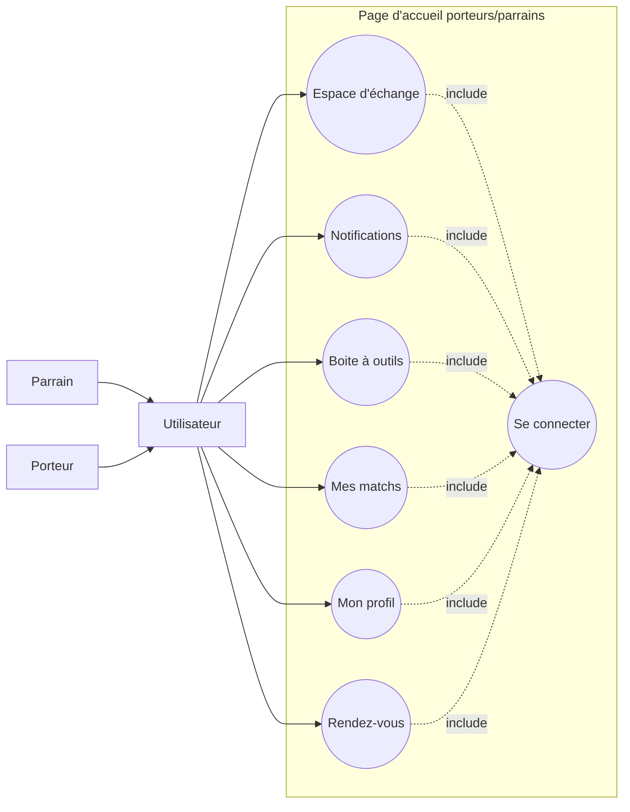
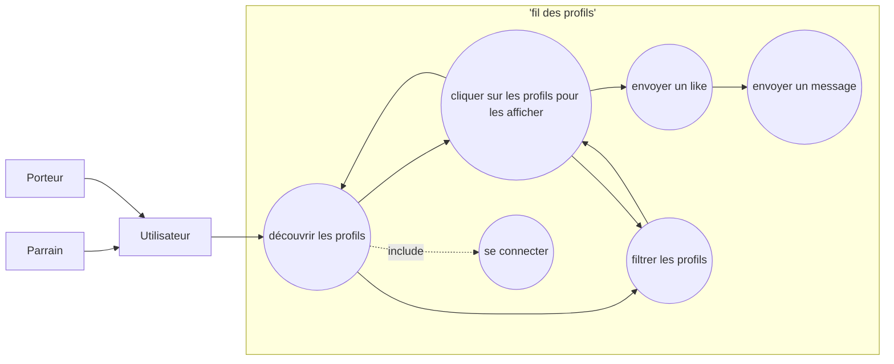
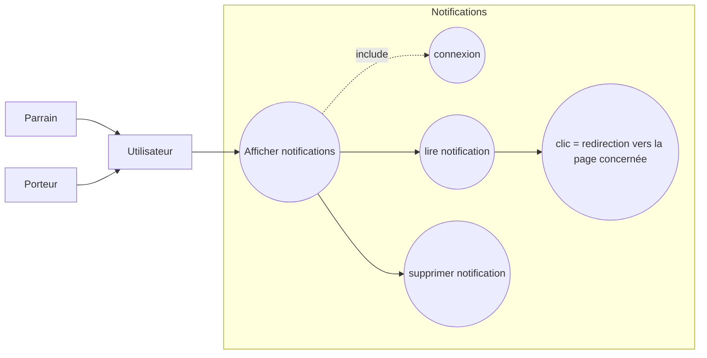
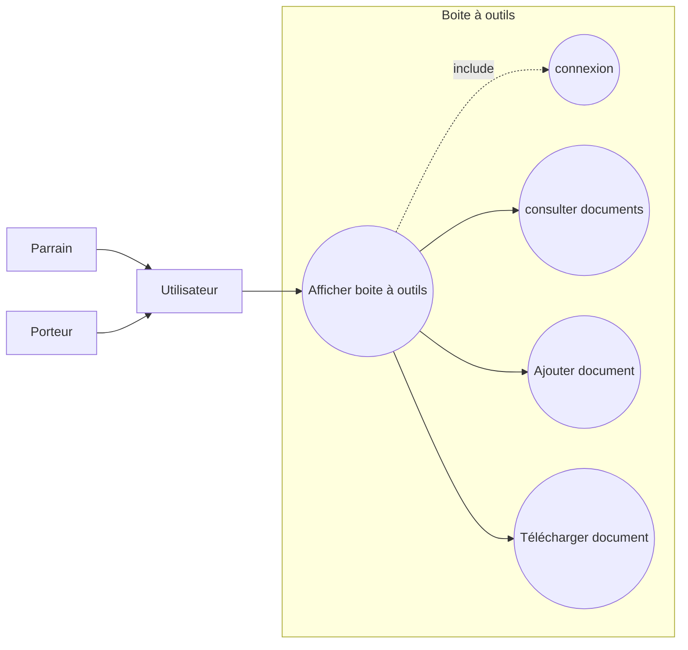
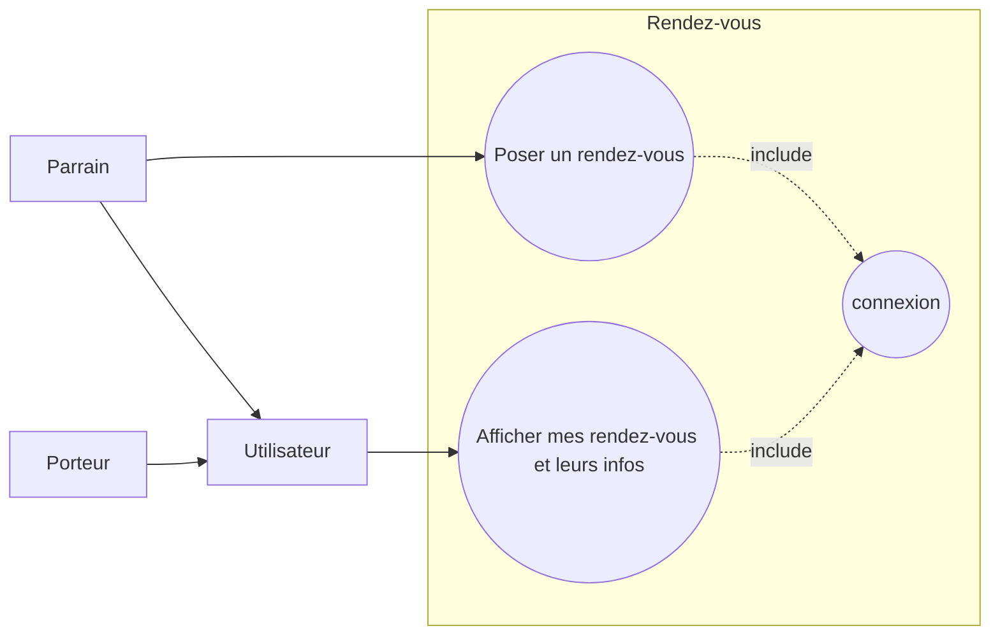
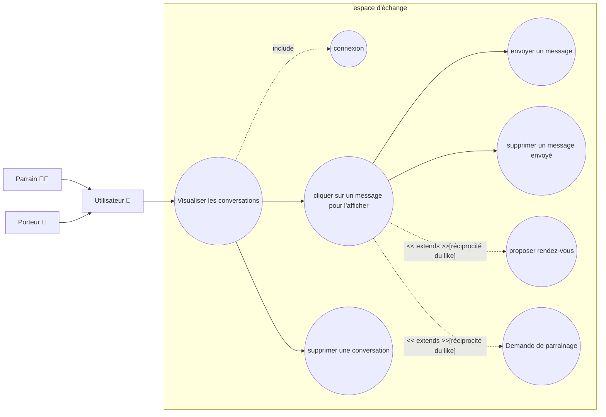
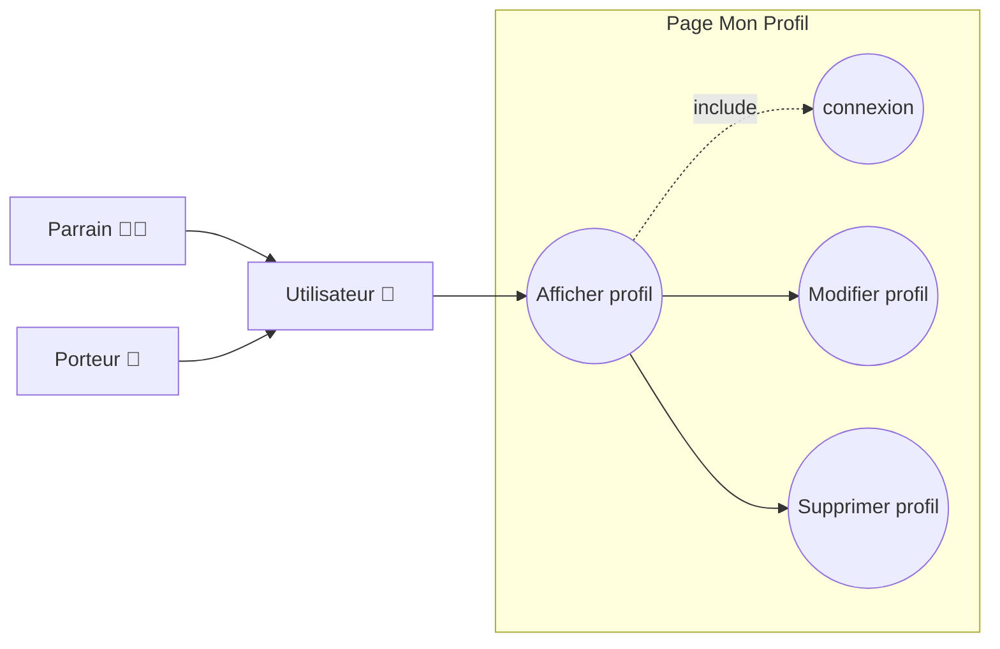
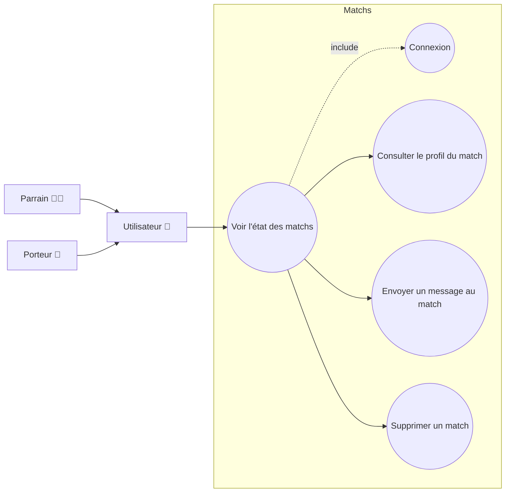

# Page d'accueil Porteurs / parrains

```mermaid
flowchart LR
subgraph Page d'accueil porteurs/parrains
uc2((Se connecter))
uc3((Espace d'échange))
uc4((Notifications))
uc5((Boite à outils))
uc6((Mes matchs))
uc7((Mon profil))
uc8((Rendez-vous))

end
user[Utilisateur]
port[Porteur]
parr[Parrain]

parr --> user
port --> user


user --> uc3-. include .-> uc2
user --> uc4-. include .-> uc2
user --> uc5-. include .-> uc2
user --> uc6-. include .-> uc2
user --> uc7-. include .-> uc2
user --> uc8-. include .-> uc2
```

# Page fil des profils

```mermaid
flowchart LR
subgraph 'fil des profils'
uc1((découvrir les profils))
uc2((cliquer sur les profils pour les afficher))
uc3((envoyer un message))
uc4((envoyer un like))
uc5((filtrer les profils))


log((se connecter))
end

user --> uc1 -. include .-> log
uc1 --> uc2
uc4 --> uc3
uc2 --> uc4
uc2 --> uc1
uc1 --> uc5
uc5 --> uc2
uc2 --> uc5

user[Utilisateur]
port[Porteur]
parr[Parrain]
parr --> user
port --> user
```
# Page Notifications

```mermaid
flowchart LR
subgraph Notifications
log((connexion))
uc1((Afficher notifications))
uc2((lire notification))
uc3((supprimer notification))
uc4((clic = redirection vers la page concernée))
end

user --> uc1 -. include .-> log
uc1 --> uc2
uc1 --> uc3
uc2 --> uc4
user[Utilisateur]
port[Porteur]
parr[Parrain]
parr --> user
port --> user
```

# Page boite à outils

```mermaid
flowchart LR
subgraph Boite à outils
log((connexion))
uc1((Afficher boite à outils))
uc2((consulter documents))
uc3((Ajouter  document))
uc4((Télécharger  document))
end

user --> uc1 -. include .-> log
uc1 --> uc2
uc1 --> uc3
uc1 --> uc4
user[Utilisateur]
port[Porteur]
parr[Parrain]
parr --> user
port --> user
```
# Page Rendez-vous

```mermaid
flowchart LR
subgraph Rendez-vous
log((connexion))
uc1((Afficher mes rendez-vous et leurs infos))
uc2((Poser un rendez-vous))
end

user --> uc1 -. include .-> log
parr --> uc2 -. include .-> log

user[Utilisateur]
port[Porteur]
parr[Parrain]
parr --> user
port --> user
```

# Page espace d'échange

```mermaid
flowchart LR
subgraph espace d'échange
log((connexion))
uc1((Visualiser les conversations))
uc2((cliquer sur un message pour l'afficher))
uc3((envoyer un message))
uc4((supprimer un message envoyé))
uc5((proposer rendez-vous))
uc6((Demande de parrainage))
uc7((supprimer une conversation))
end

user --> uc1 -. include .-> log
uc1 --> uc2
uc2 --> uc3
uc2 --> uc4
uc2 -. << extends >>[réciprocité du like] .-> uc6
uc2 -. << extends >>[réciprocité du like] .-> uc5
uc1 --> uc7
user[Utilisateur 👩]
port[Porteur 👶]
parr[Parrain 👨‍🎤]
parr --> user
port --> user
```
# Page Mon Profil

```mermaid
flowchart LR
subgraph Page Mon Profil
log((connexion))
uc1((Afficher profil))
uc2((Modifier profil))
uc3((Supprimer profil)) 
end

user[Utilisateur 👩]
port[Porteur 👶]
parr[Parrain 👨‍🎤]
parr --> user
port --> user
user --> uc1 -. include .-> log
uc1 --> uc2
uc1 --> uc3

```

# Page matchs

```mermaid
flowchart LR
subgraph Matchs
log((Connexion))
uc1((Voir l'état des matchs))
uc2((Consulter le profil du match))
uc3((Envoyer un message au match))
uc4((Supprimer un match))
end

user[Utilisateur 👩]
port[Porteur 👶]
parr[Parrain 👨‍🎤]
parr --> user
port --> user

user --> uc1 -. include .-> log
uc1 --> uc2
uc1 --> uc3
uc1 --> uc4
```
