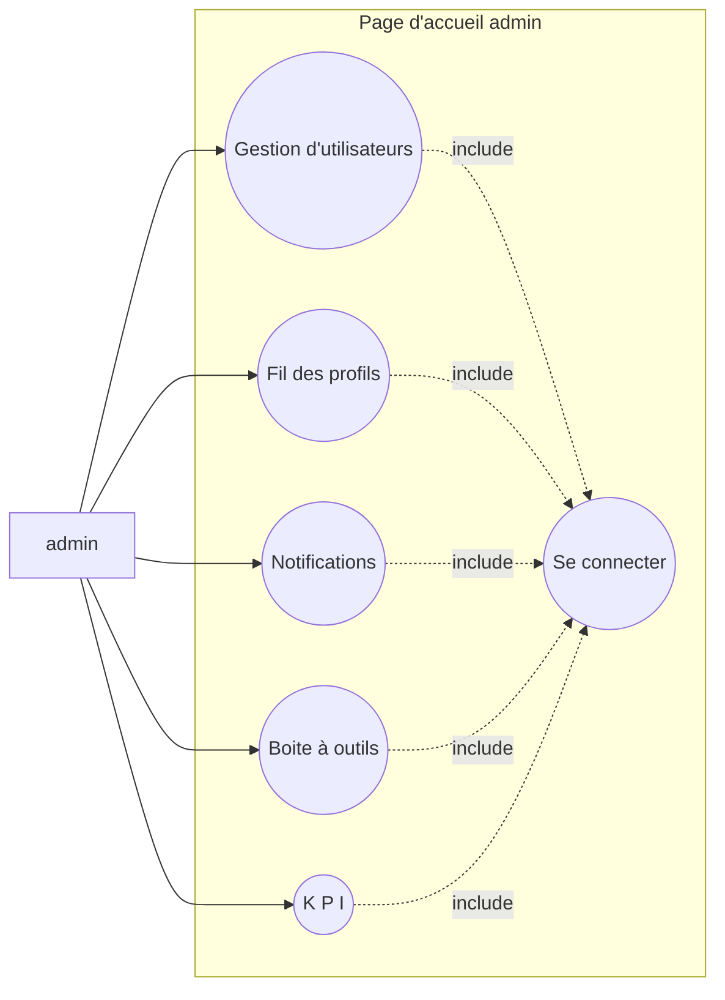
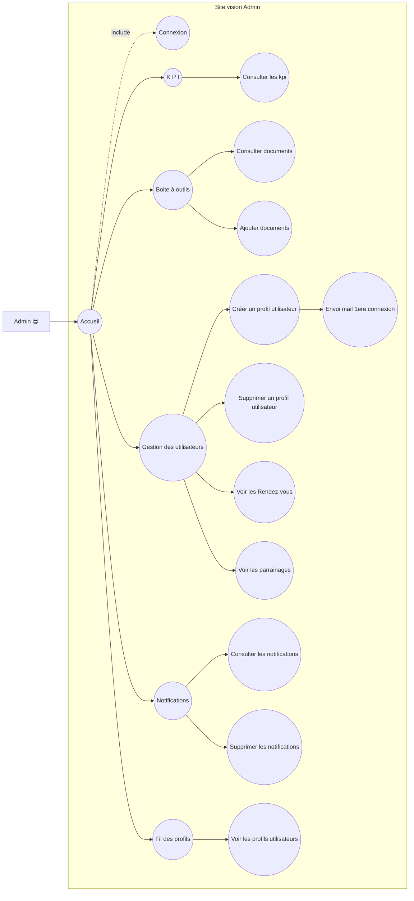

# Page d'accueil Administrateur

```mermaid
flowchart LR
subgraph Page d'accueil admin
log((Se connecter))
uc1((Gestion d'utilisateurs))
uc2((Fil des profils))
uc4((Notifications))
uc5((Boite à outils))
uc8((K P I))
end
admin --> uc1 -. include .-> log
admin --> uc2 -. include .-> log
admin --> uc4 -. include .-> log
admin --> uc5 -. include .-> log
admin --> uc8 -. include .-> log


```

# Site vision Admin

```mermaid
flowchart LR
subgraph Site vision Admin
log((Connexion))
uc1((Accueil))
uc2(( K P I))
uc3((Boite à outils))
uc4((Consulter les kpi))
uc5((Gestion des utilisateurs))
uc6((Ajouter documents))
uc7((Créer un profil utilisateur))
uc8((Envoi mail 1ere connexion))
uc9((Notifications))
uc10((Fil des profils))
uc11((Supprimer un profil utilisateur))
uc12((Voir les Rendez-vous))
uc13((Consulter documents))
uc14((Voir les profils utilisateurs))
uc15((Voir les parrainages))
uc16((Consulter les notifications))
uc17((Supprimer les notifications))
end

admin[Admin 😎]
admin --> uc1 -. include .-> log
uc1 --> uc2
uc1 --> uc3
uc1--> uc5
uc2 --> uc4
uc3 --> uc13
uc3 --> uc6
uc5 --> uc7
uc5 --> uc11
uc5 --> uc12
uc5 --> uc15
uc7 --> uc8
uc1 --> uc9
uc1 --> uc10
uc10 --> uc14
uc9 --> uc16
uc9 --> uc17
```