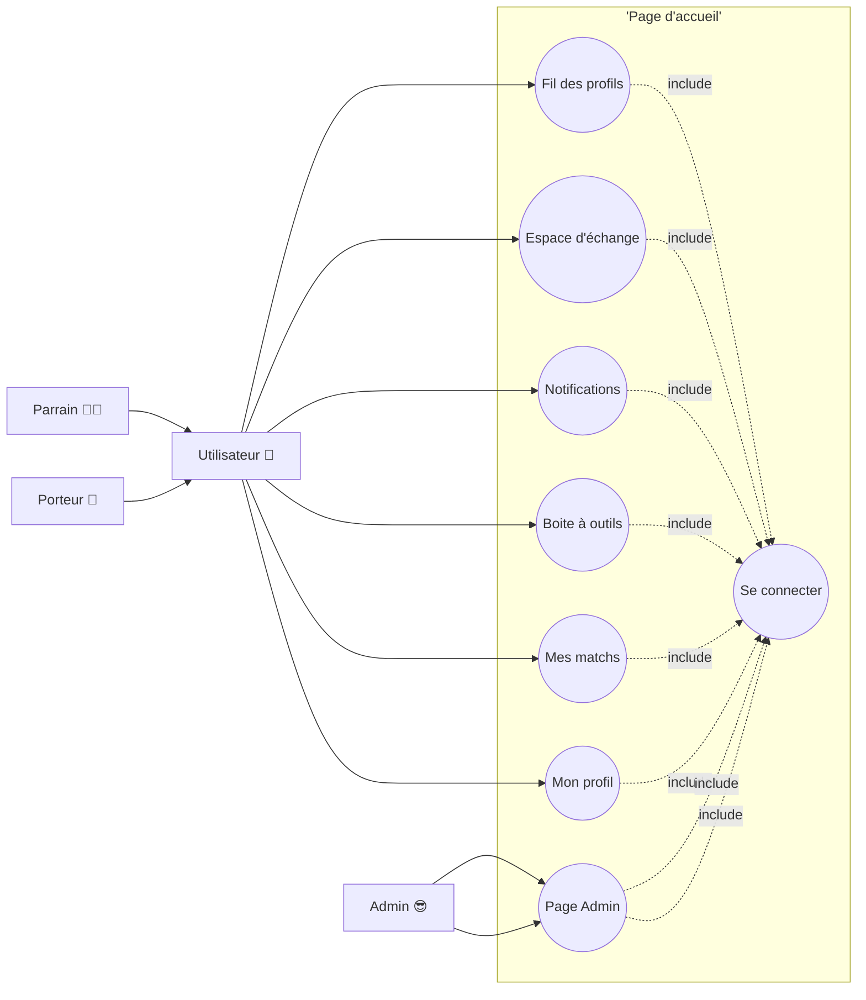
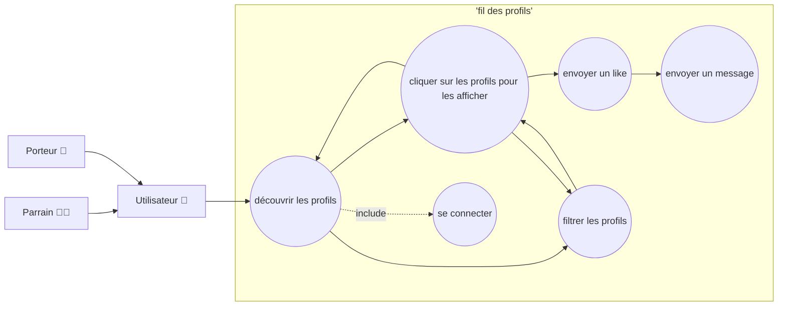
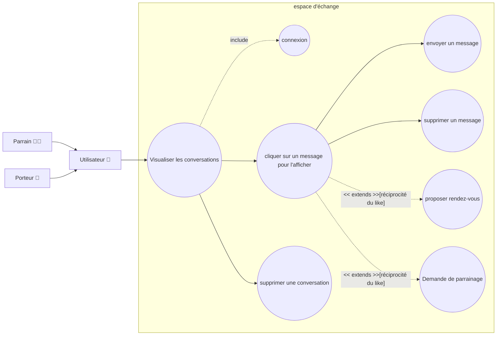
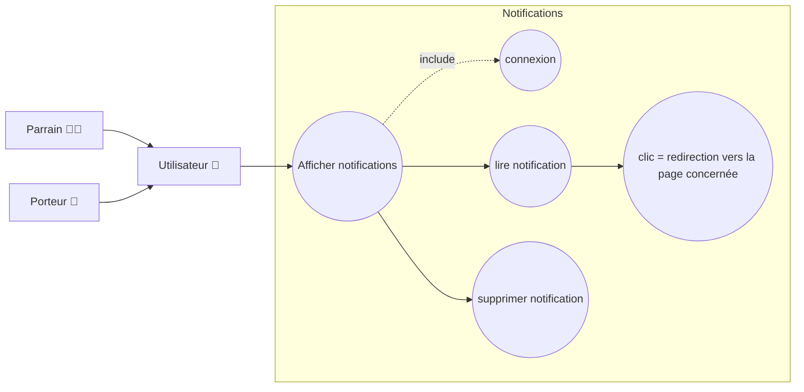
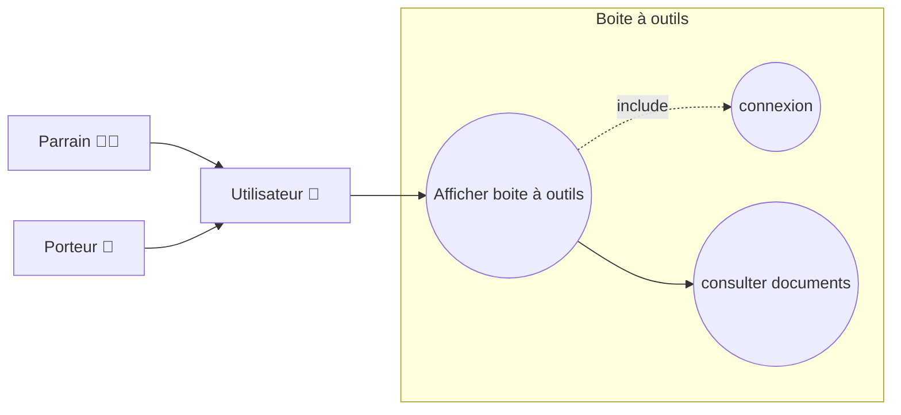
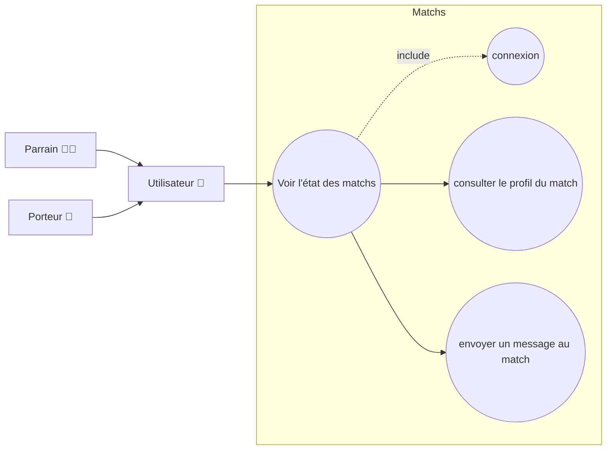
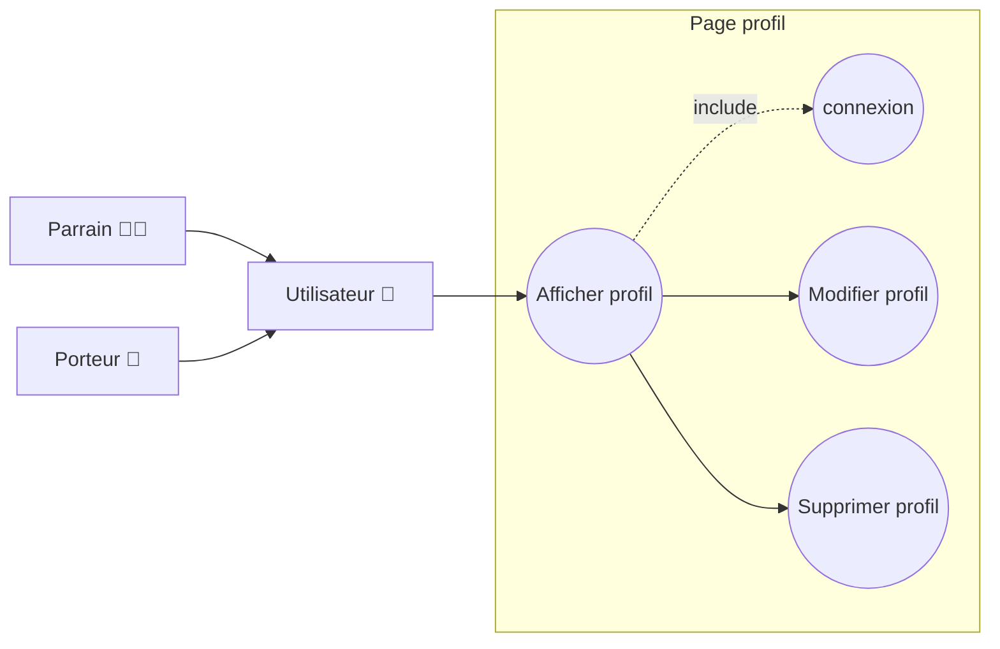
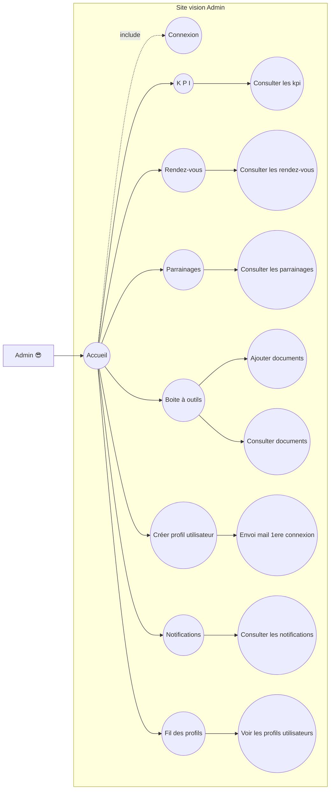

# Page d'accueil

```mermaid
flowchart LR
subgraph 'Page d'accueil'
uc1((Fil des profils))
uc2((Se connecter))
uc3((Espace d'échange))
uc4((Notifications))
uc5((Boite à outils))
uc6((Mes matchs))
uc7((Mon profil))
uc8((Page Admin))
end
user[Utilisateur 👩]
port[Porteur 👶]
parr[Parrain 👨‍🎤]
admin[Admin 😎]

parr --> user
port --> user


user ---> uc1-. include .-> uc2
user ---> uc3-. include .-> uc2
user ---> uc4-. include .-> uc2
user ---> uc5-. include .-> uc2
user ---> uc6-. include .-> uc2
user ---> uc7-. include .-> uc2
admin --> uc8 -. include .-> uc2
admin --> uc8 -. include .-> uc2
```

# Page fil des profils

```mermaid
flowchart LR
subgraph 'fil des profils'
uc1((découvrir les profils))
uc2((cliquer sur les profils pour les afficher))
uc3((envoyer un message))
uc4((envoyer un like))
uc5((filtrer les profils))


log((se connecter))
end

user --> uc1 -. include .-> log
uc1 --> uc2
uc4 --> uc3
uc2 --> uc4
uc2 --> uc1
uc1 --> uc5
uc5 --> uc2
uc2 --> uc5

user[Utilisateur 👩]
port[Porteur 👶]
parr[Parrain 👨‍🎤]
parr --> user
port --> user

```
# Page espace d'échange

```mermaid
flowchart LR
subgraph espace d'échange
log((connexion))
uc1((Visualiser les conversations))
uc2((cliquer sur un message pour l'afficher))
uc3((envoyer un message))
uc4((supprimer un message))
uc5((proposer rendez-vous))
uc6((Demande de parrainage))
uc7((supprimer une conversation))
end

user --> uc1 -. include .-> log
uc1 --> uc2
uc2 --> uc3
uc2 --> uc4
uc2 -. << extends >>[réciprocité du like] .-> uc6
uc2 -. << extends >>[réciprocité du like] .-> uc5
uc1 --> uc7
user[Utilisateur 👩]
port[Porteur 👶]
parr[Parrain 👨‍🎤]
parr --> user
port --> user
```
# Page Notifications

```mermaid
flowchart LR
subgraph Notifications
log((connexion))
uc1((Afficher notifications))
uc2((lire notification))
uc3((supprimer notification))
uc4((clic = redirection vers la page concernée))
end

user --> uc1 -. include .-> log
uc1 --> uc2
uc1 --> uc3
uc2 --> uc4
user[Utilisateur 👩]
port[Porteur 👶]
parr[Parrain 👨‍🎤]
parr --> user
port --> user

```
# Page boite à outils

```mermaid
flowchart LR
subgraph Boite à outils
log((connexion))
uc1((Afficher boite à outils))
uc2((consulter documents))
end

user --> uc1 -. include .-> log
uc1 --> uc2
user[Utilisateur 👩]
port[Porteur 👶]
parr[Parrain 👨‍🎤]
parr --> user
port --> user

```

# Page matchs

```mermaid
flowchart LR
subgraph Matchs
log((connexion))
uc1((Voir l'état des matchs))
uc2((consulter le profil du match))
uc3((envoyer un message au match))
end

user --> uc1 -. include .-> log
uc1 --> uc2
uc1 --> uc3
user[Utilisateur 👩]
port[Porteur 👶]
parr[Parrain 👨‍🎤]
parr --> user
port --> user

```

# Page profils

```mermaid
flowchart LR
subgraph Page profil
log((connexion))
uc1((Afficher profil))
uc2((Modifier profil))
uc3((Supprimer profil))
end

user[Utilisateur 👩]
port[Porteur 👶]
parr[Parrain 👨‍🎤]
parr --> user
port --> user
user --> uc1 -. include .-> log
uc1 --> uc2
uc1 --> uc3

```

# Site vision Admin

```mermaid
flowchart LR
subgraph Site vision Admin
log((Connexion))
uc1((Accueil))
uc2(( K P I))
uc3((Rendez-vous))
uc4((Parrainages))
uc5((Boite à outils))
uc6((Ajouter documents))
uc7((Créer profil utilisateur))
uc8((Envoi mail 1ere connexion))
uc9((Notifications))
uc10((Fil des profils))
uc11((Consulter les parrainages))
uc12((Consulter les kpi))
uc13((Consulter documents))
uc14((Voir les profils utilisateurs))
uc15((Consulter les rendez-vous))
uc16((Consulter les notifications))
end

admin[Admin 😎]
admin --> uc1 -. include .-> log
uc1 --> uc2
uc1 --> uc3
uc1 --> uc4
uc1 --> uc5
uc5 --> uc6
uc1 --> uc7
uc7 --> uc8
uc1 --> uc9
uc1 --> uc10
uc2 --> uc12
uc3 --> uc15
uc4 --> uc11
uc5 --> uc13
uc10 --> uc14
uc9 --> uc16
```